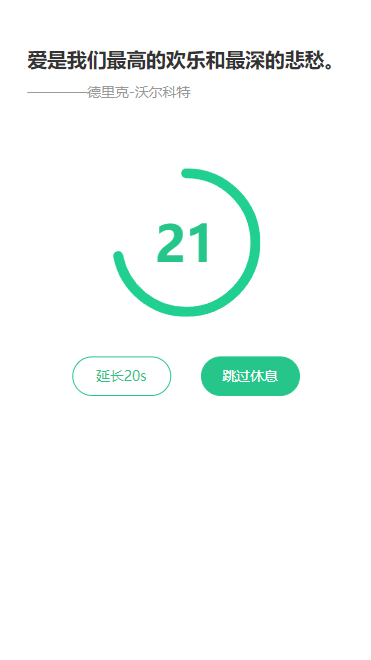

# Project Name

Vue2 UI component for mobile terminal countdown of imitation keep application

仿 keep App 倒计时 Vue2 UI 组件



## Install

### NPM package installation

```
npm i keep-countdown
import CountDown from 'keep-countdown'
import from 'keep-countdown/index.css'
```

### Runtime

```
npm i vu2b -g
npm i
vu2b --server
```

### Pack

```
vu2b
```

## Props

| name   | type   | default | intro            |
| ------ | ------ | ------- | ---------------- |
| radius | number | 70      | svg cycle radius |
| second | number | 30      | initial second   |

## Events

| name   | return                   | intro                                 |
| ------ | ------------------------ | ------------------------------------- |
| change | ( second : number )=> {} | Triggered when the countdown changes  |
| end    | ( )=> {}                 | Triggered at the end of the countdown |
